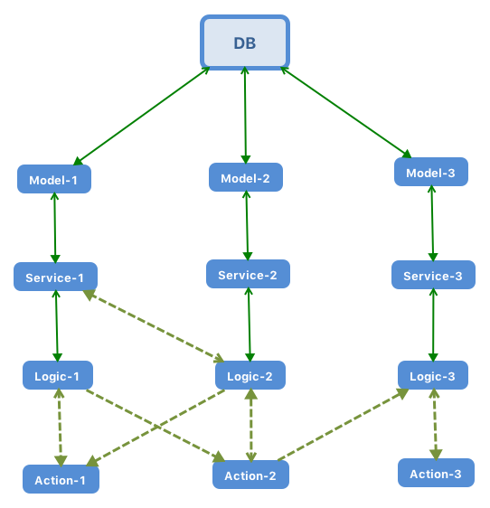

# 关于Sketch

> Sketch为项目初始模板, 初始化时即自动创建了必须的依赖包

### 用法与参考

1. **标准结构**
    1. [Controllers](./app.controllers.md) - 控制器用法
    1. [Errors](./app.errors.md) - 错误定义用法
    1. [Logics](./app.logics.md) - 业务逻辑约束
    1. [Models](./app.models.md) - Models约束
    1. [Services](./app.services.md) - Services约束
    1. [Structs](https://github.com/uniondrug/structs/blob/2.x/docs/README.md) - 结构体
1. **扩展结构**
    1. Servers - 服务端约束
    1. Tasks - 计划任务
1. **常用参考**
    1. [ServiceTrait](./usages/service.trait.md)
    1. [Logger](./usages/logger.md)
    1. [Provider](./usages/provider.md)
    1. [Response](./usages/response.md)

### 中间件

1. 缓存
1. MQ

### 业务抽离

1. Gateway
1. Authentication
1. Cache
1. MQ

### 一些技巧

1. Service联接查询

### 依赖包

* 内部
    * **uniondrug/cache** - 缓存 - [Github](https://github.com/uniondrug/cache)
    * **uniondrug/common** - 公共 - [Github](https://github.com/uniondrug/common)
    * **uniondrug/console** - 控制台 - [Github](https://github.com/uniondrug/console)
    * **uniondrug/framework** - **框架+** - [Github](https://github.com/uniondrug/framework)
    * **uniondrug/http-client** - **HTTP请求+** - [Github](https://github.com/uniondrug/http-client)
    * **uniondrug/middleware** - **中间件+** - [Github](https://github.com/uniondrug/middleware)
    * **uniondrug/mq** - MQ消息 - [Github](https://github.com/uniondrug/mq)
    * **uniondrug/register** - **服务注册+** - [Github](https://github.com/uniondrug/register)
    * **uniondrug/server** - 服务端 - [Github](https://github.com/uniondrug/server)
    * **uniondrug/service** - **服务主包+** - [Github](https://github.com/uniondrug/service)
    * **uniondrug/structs** - **结构体+** - [Github](https://github.com/uniondrug/structs)
    * **uniondrug/swoole** - swoole组件 - [Github](https://github.com/uniondrug/swoole)
    * **uniondrug/trace** - **trace请求链+** - [Github](https://github.com/uniondrug/trace)
    * **uniondrug/validation** - **验证器+** - [Github](https://github.com/uniondrug/validation)
* 外部
    * **guzzlehttp/guzzle**
    * **guzzlehttp/promises**
    * **guzzlehttp/psr7**
    * **psr/http-message**

### 待处理

1. uncatched exception error code
1. withStruct replace withObject/withList/withPaging
1. dev step by step

